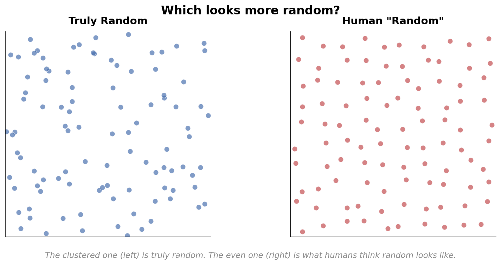
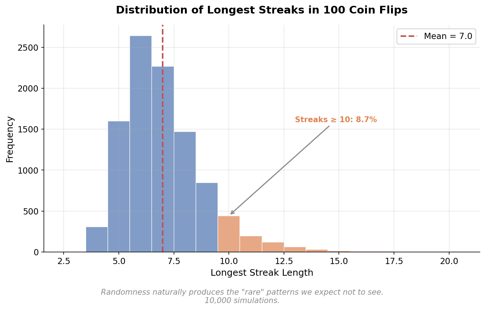
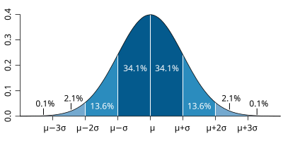

# Chapter 1: The Pattern-Seeking Mind

## Metadata
- **Part**: 1 - Intuition
- **Topics**: Pattern recognition, cognitive biases, randomness perception
- **Key Concepts**: Apophenia, selective attention, null hypothesis intuition

---

## The Clustering Illusion

Here's something strange. Look at two grids of random dots. One was generated by a computer—each point placed uniformly at random in a square. The other was created by a person trying to make a "random" pattern by hand.

Which one looks more random to you?

If you're like most people, you'll choose wrong. The truly random one looks lumpy and uneven—clusters of dots here, bare spaces there. It offends your sense of order. The hand-made one looks more evenly distributed, more intentional. But that's exactly backward.

This is the clustering illusion, and it's the first hint that our brains are hopeless at understanding randomness.

---

## Seeing Randomness

Let's see this for ourselves. Here's a simple simulation: place 200 random points in a square.

<div align="center">



**Figure 1.1:** Side-by-side comparison of truly random points (left) versus a human attempt at randomness (right). Notice how the random distribution has visible clusters and gaps—exactly what statistical randomness produces. The human-generated pattern feels more evenly distributed, which is precisely why humans are bad at intuiting randomness.

</div>

```python
import random
import matplotlib.pyplot as plt

# Generate random points
num_points = 200
points = [(random.random(), random.random()) for _ in range(num_points)]

# Plot them
x = [p[0] for p in points]
y = [p[1] for p in points]

plt.figure(figsize=(8, 8))
plt.scatter(x, y, s=20, alpha=0.6)
plt.xlim(0, 1)
plt.ylim(0, 1)
plt.gca().set_aspect('equal')
plt.title("Truly Random Points")
plt.show()
```

Run this a few times. Each time you'll see something that feels *wrong*. Dense clusters. Isolated gaps. Why isn't this evenly spread out?

The answer is simple: because it's random.

Now try this—generate a few sequences by hand. Write down 100 coin flips (heads and tails) as if you're generating random data. Don't overthink it. Just go with your gut.

Done? Now generate 100 actual coin flips:

```python
import random

# True randomness: 100 coin flips
flips = [random.choice(['H', 'T']) for _ in range(100)]
print(''.join(flips))
```

Compare your sequence to the computer's. What's different?

If you're typical, your sequence:
- Alternates more often (fewer long streaks)
- Has roughly equal H's and T's early on (not at the end)
- Feels more "balanced" overall

The computer's sequence:
- Has longer runs of the same result
- Might have many more H's or T's in the first 20 flips
- Feels bunched and nonuniform

This is telling us something important: **we don't know what randomness looks like**.

---

## How Clusters Fool Us

Now let's look at this more systematically. Run many simulations of 100 coin flips and measure the longest streak of heads:

```python
import random

def longest_streak(flips):
    """Find the longest consecutive sequence of heads."""
    max_streak = 0
    current_streak = 0
    for flip in flips:
        if flip == 'H':
            current_streak += 1
            max_streak = max(max_streak, current_streak)
        else:
            current_streak = 0
    return max_streak

# Run many simulations
num_simulations = 10000
streaks = []
for _ in range(num_simulations):
    flips = [random.choice(['H', 'T']) for _ in range(100)]
    streaks.append(longest_streak(flips))

# What's typical?
import statistics
print(f"Average longest streak: {statistics.mean(streaks):.1f}")
print(f"Median longest streak: {statistics.median(streaks)}")
print(f"Min: {min(streaks)}, Max: {max(streaks)}")
```

Run this and you'll probably be surprised. The average longest streak in 100 flips is around 7. Not 5. Not 4. About 7.

How many people, before seeing this, would have guessed that? Most would say 3, maybe 4 if pushed. But 7?

Yet this isn't rare. Run 10,000 simulations and a streak of 7+ happens in about 95% of them.

<div align="center">



**Figure 1.2:** Distribution of longest streaks in 100 coin flips across 10,000 simulations. The mean is approximately 7, and streaks of 10 or more occur regularly. This distribution captures the clustering illusion: randomness naturally produces the "rare" patterns we expect not to see.

</div>

This is the clustering illusion: when randomness creates the very clusters we expect *not* to see, we interpret them as evidence of nonrandomness.

### The London Bombing Campaign

<div align="center">



**Figure 1.3:** Map of V-2 rocket impacts on London during WWII. Impacts appear clustered in certain areas, which led residents and military observers to suspect intentional targeting. Statistical analysis confirmed the clustering was consistent with random placement—a striking example of how randomness *appears* nonrandom.

</div>

Here's a real example that shook people's confidence. During World War II, German V-2 rockets rained on London. Citizens noticed something alarming: the impacts seemed clustered. They thought the Germans must be targeting specific areas.

Statisticians looked at the data and did something simple: they checked if the clustering was consistent with random placement.

It was.

In fact, purely random bombs create exactly the kind of lumpy, clustered pattern that Londoners interpreted as intentional targeting. When something is truly random, you *expect* clusters. Uniformity would have been the sign of a pattern.

### Cancer Clusters

Every few years, a town will discover that there are slightly more cancer cases than expected—maybe a cluster near a factory, or a few blocks in a neighborhood. Parents get frightened. Lawsuits are filed. Researchers descend.

And almost always, when the statisticians dig into it: nothing. The "cluster" is what random chance produces when you have a lot of towns and a rare disease. Some towns will get unlucky. Some will get lucky. The clustering is a mirage created by the expectation-paradox: randomness looks nonrandom.

---

## Why We're Pattern Detectors

Why are we like this?

Humans are pattern-detecting machines. For most of our evolutionary history, spotting patterns was survival. A rustle in the grass might be a predator. A seasonal pattern meant you knew when to plant. Noticing which berry bush was which meant not dying.

Our ancestors who were *too skeptical* about patterns didn't survive. The ones who jumped at shadows, who saw faces in the clouds, who imagined connections—some of them were paranoid for no reason, but some of them lived another day.

We're built to detect patterns, even weak ones, even false ones. This works beautifully for most of life. But it fails catastrophically when we encounter true randomness.

### The Base Rate Problem

Here's another way to think about it. Imagine you have a town of 100,000 people. Let's say one in 10,000 people develops a rare disease in any given year. On average, you'd expect 10 cases.

But "on average" doesn't mean exactly 10. Sometimes you get 15. Sometimes you get 3. Sometimes you get 8, then 2, then 22.

If you're not thinking statistically, and you see 20 cases in one neighborhood, you think "something's causing this." You assume there's a cause—a factory, a water supply, a shared exposure.

But with random variation, you're *guaranteed* to find clusters somewhere if you look at enough neighborhoods, at enough times, with enough diseases.

This is the base rate problem: you see clusters and assume a cause, forgetting that clusters are the default when randomness is at work.

### The Birthday Paradox

Here's a light version of the same idea. In a group of 23 people, what's the probability that two share a birthday?

Most people guess something small. 5%? 10%?

The answer is about 50%. This shocks people. It seems impossible.

But think about it this way: you don't need two people to match a specific birthday (like "both born on January 3"). You just need *any two people* to match *each other*. That's a much looser condition.

With 23 people, you have a lot of pairs: 23 × 22 / 2 = 253 different pairs. Each pair is a chance for a match. When you have that many opportunities for coincidence, it becomes likely.

Here's the calculation: Start with the first person (any birthday is fine). The second person has a 364/365 chance of being different. The third has a 363/365 chance of being different from the first two. Keep multiplying:

$$P(\text{all different}) = \frac{365}{365} \times \frac{364}{365} \times \frac{363}{365} \times \cdots \times \frac{343}{365}$$

This works out to about 0.507. So the probability that at least two people *do* match is:

$$P(\text{match}) = 1 - 0.507 = 0.493 \approx 50\%$$

<div align="center">


**Figure 1.4:** Probability of at least two shared birthdays as a function of group size. Notice the sharp transition around 20–25 people. This counterintuitive curve shows why coincidences are inevitable when you have many opportunities for them to occur.

</div>

Why does this matter? Because it shows how much clustering we should *expect* in random data. When you have many opportunities for a coincidence (many pairs of people, many pairs of birthdays), coincidences happen constantly. They're not miraculous. They're inevitable.

---

## Cousins of the Illusion

### The Hot Hand—Maybe Not a Fallacy?

For decades, psychologists said the "hot hand" in basketball was a cognitive illusion. A player hits three shots in a row, and fans expect another. But the statistics say no—each shot is independent. The streak just feels hot because we see patterns everywhere.

Recently, some researchers challenged this. Maybe the hot hand is real. Maybe basketball players *do* perform differently after a streak. Maybe our intuition wasn't entirely wrong.

This is a genuinely open question. But our intuitions are still miscalibrated—we see hot hands everywhere, even in coin flips, so even if the effect is real, we probably overestimate it.

### The Gambler's Fallacy

A coin has come up heads five times in a row. What's the probability the next flip is tails?

It's still 50%.

This is obvious when stated directly. But people feel that tails is "due." The coin "owes" them a tail after so many heads. This is the gambler's fallacy.

The math is simple: each flip is independent. The past doesn't create a debt. Probability doesn't have memory.

Yet the intuition is persistent. People make enormous bets based on this false belief. And they lose.

### Apophenia: Seeing Meaning in Randomness

Apophenia is the tendency to perceive connections between unrelated things. It's the human pattern-detector at full volume, unconstrained by evidence.

A few examples:
- Conspiracy theories: noticing that events seem connected (JFK assassination, 9/11, etc.) and assuming they must be.
- The Bible Code: finding hidden messages in random letters of the Bible (if you look long enough, you'll find patterns in any text).
- Numerology: reading meaning into number coincidences.

This isn't stupidity. Intelligent people do this all the time. The pattern-detecting machinery is just very good at its job—too good, in some cases.

---

## Testing It Against Reality

Let's look at actual basketball data. We'll take some real shooting records and search for "hot hand" streaks. Then we'll compare them to simulated random shooting.

<div align="center">


**Figure 1.5:** Comparison of streak lengths in real basketball shooting (blue) versus simulated random shooting (gray). The distributions are remarkably similar, suggesting that visible streaks in real shooting don't necessarily indicate a "hot hand" effect—they may just be what randomness produces.

</div>

*See [simulations.py](simulations.py) for code that does this analysis.*

When you run the comparison, you'll find that:
- Real shooting data has some streaks, some cold stretches
- Simulated random shooting has *about as many*
- This doesn't prove the hot hand doesn't exist (it might), but it shows the streaks we see in real data aren't obviously different from what randomness produces

This is a subtle point: random data will *look* streaky. So seeing streaks in real data doesn't tell us much. We need statistical tests, not just eyeballing.

---

## Exercises

See [exercises.md](exercises.md) for practice problems.

---

## Rabbit Holes

<details>
<summary><strong>The Bible Code</strong></summary>

In the 1990s, a book called *The Bible Code* claimed that hidden messages were encoded in the Torah. Using a technique called "equidistant letter spacing," researchers claimed to find predictions of historical events—assassinations, wars, disasters.

The claim was that this couldn't be chance. The "coincidences" were too perfect.

The problem: if you look hard enough in any long text, equidistant spacing will create words by chance. Statisticians took a copy of the Hebrew Bible and found the same kinds of patterns. They found "predictions" of events that hadn't happened yet—which contradicted the claim that the code was predicting real events.

The lesson: when you're looking for patterns in a large dataset, you can almost always find them. The question isn't "are there patterns?" but "is the pattern frequency different from what randomness produces?"

</details>

<details>
<summary><strong>Confirmation Bias and Conspiracy Thinking</strong></summary>

Once we think we've spotted a pattern, confirmation bias kicks in. We notice evidence that supports our theory and ignore evidence that contradicts it.

This is especially powerful with conspiracy theories. If you believe the government is monitoring you, every coincidence becomes evidence. A deleted email, a chance encounter, a news story—all confirming your suspicion. Evidence against your theory is explained away: "That's exactly what they'd want you to think."

The pattern-seeking mind, once locked onto a target, is very hard to shake.

</details>

<details>
<summary><strong>Why Slot Machines Use Near Misses</strong></summary>

Slot machines are programmed to create "near misses"—spindles that almost line up but don't. A player gets two cherries and one lemon instead of three cherries.

Psychologically, this is powerful. The near miss feels like you *almost won*. It makes you want to play again.

But statistically? A near miss is just a loss. You didn't win. The closer you came to winning doesn't matter—the outcome is the same.

Yet the near miss feels different. It feels like a sign. Like luck is close. And this feeling keeps people playing.

The casino uses our pattern-seeking minds against us, creating the illusion of almost winning when we lost completely.

</details>

---

## Summary

Our brains are exquisitely tuned pattern-matching machines. We find structure in noise, meaning in chaos, intention in accident. This served us beautifully on the savanna but fails us in the age of statistics.

When we encounter true randomness, we see clusters and interpret them as patterns. We see streaks and think they mean something. We see coincidences and assume connections. We are, in a word, terrible at intuiting randomness.

The first step to understanding randomness is accepting that our intuitions will betray us. The second step is learning to see what randomness actually looks like. And the third step? Learning to trust the data more than our guts.

---

## What's Next

If we can't trust our intuition, what does randomness actually look like? Let's watch it unfold and build some better intuition.
