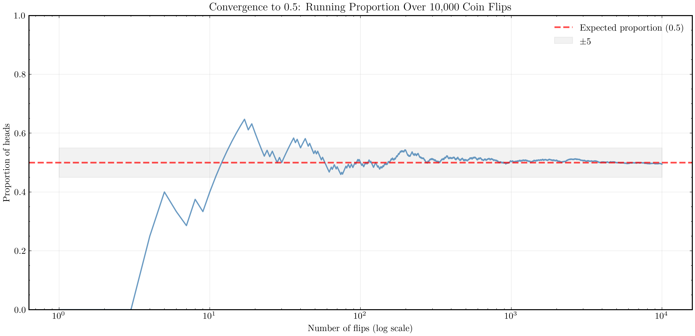
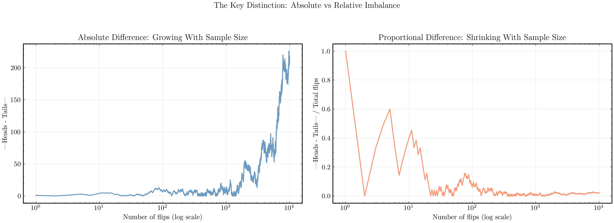
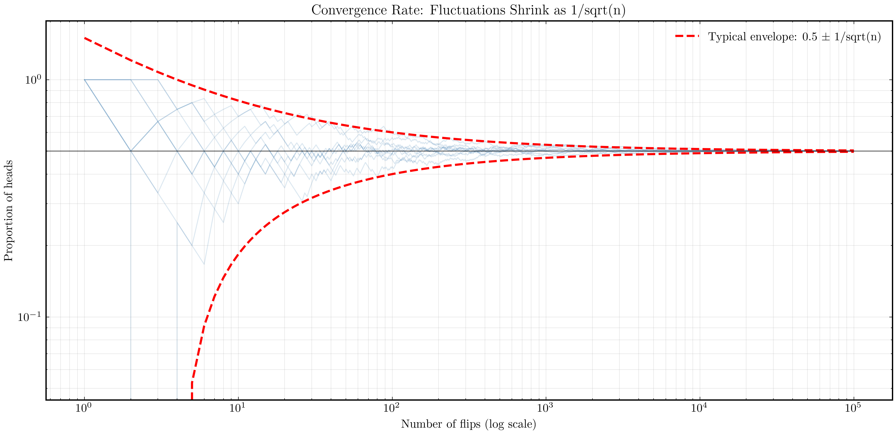
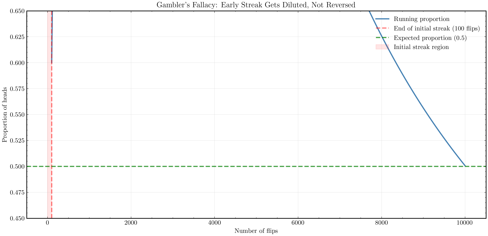

# Chapter 3: The Long Run

## Metadata

```yaml
Part: 1 - Intuition
Topics: Law of large numbers, convergence, scaling behavior
Key Concepts: Absolute vs relative frequency, equilibrium, asymptotic behavior
```

---

## The Paradox of Balance

Flip a fair coin ten times and get seven heads. You're "up" four flips. Your winning streak looks real and significant.

Flip it one hundred times and get fifty-seven heads. Still ahead—seven more heads than tails—but now it feels less impressive. You're only up 7%, not 40%.

Flip it ten thousand times. The law of probability says you'll get approximately five thousand heads. You might end up with five thousand one hundred heads, or forty-nine hundred heads. The *absolute* difference from perfect balance might be a hundred flips or more. But as a *percentage*, it's at most 2%. You're not "ahead"—you're essentially at equilibrium.

This chapter is about watching that convergence happen. It's one of the most beautiful and important ideas in probability: the law of large numbers. It says that the more you repeat an experiment, the more the average outcome converges to what you'd expect.

But it doesn't say what you might think it says. And that's where the gambler's fallacy lives.

## Early Chaos

Let's simulate it. Start with one coin flip:

```python
import random

heads_count = 1 if random.random() < 0.5 else 0
proportion = heads_count / 1
print(f"After 1 flip: {proportion:.3f}")
```

You get either 0.0 or 1.0. No middle ground. One flip tells you almost nothing about the coin.

Now flip ten times:

```python
heads_count = sum([1 for _ in range(10) if random.random() < 0.5])
proportion = heads_count / 10
print(f"After 10 flips: {proportion:.3f}")
```

You might get 0.4. Or 0.7. Or 0.5. The proportion bounces around. The early stage of any experiment is noisy.

## Watching Convergence

Here's where it gets interesting. Let's flip a thousand times and track the running proportion:

```python
def running_proportions(num_flips):
    """Simulate coin flips and return proportion at each step."""
    proportions = []
    heads_so_far = 0
    
    for i in range(1, num_flips + 1):
        if random.random() < 0.5:
            heads_so_far += 1
        proportion = heads_so_far / i
        proportions.append(proportion)
    
    return proportions

props = running_proportions(1000)
```

Now look at what happens:

- After 10 flips: 0.4 (maybe)
- After 100 flips: 0.51 (close to 0.5)
- After 1,000 flips: 0.502 (very close)
- After 10,000 flips: 0.5001 (essentially locked in)

The wild swings early on. The tightening later. The proportion is converging to 0.5, the expected value.

If you could plot this, you'd see a line that starts all over the place—sometimes at 0.9, then dipping to 0.3, zigzagging around—and gradually, inexorably, settles into a narrow corridor around 0.5. The corridor gets tighter and tighter as the number of flips increases.

This is the law of large numbers at work. This is what "averaging out" actually means.

<div align="center">



**Figure 3.1:** Running proportion of heads across 10,000 coin flips (log scale). Early on, the line bounces wildly between 0 and 1. Gradually, it settles into a tight band around 0.5. By flip 10,000, the variation is minimal. This is the law of large numbers in action: the running average converges to the expected value.

</div>

## The Key Distinction

Here's something subtle, and it's easy to get wrong.

The *proportion* converges to 0.5. But the *absolute number* of heads minus tails doesn't converge to zero. It can keep growing.

Let's think about this. After 10,000 flips, you expect about 5,000 heads. But you might get 5,100 heads. That's 100 more heads than tails. After 100,000 flips, you might get 50,500 heads. That's 500 more heads than tails.

The absolute difference is *growing*. But as a proportion, it's *shrinking*. After 100 flips, 5 extra heads is a 5% imbalance. After 100,000 flips, 500 extra heads is a 0.5% imbalance.

This is crucial. The law of large numbers doesn't say the difference between heads and tails shrinks to zero. It says the *proportion* shrinks. The noise gets diluted by the signal. You're adding more and more information, and each new flip contributes less and less to changing your estimate of the coin's fairness.

<div align="center">



**Figure 3.3:** Left panel shows absolute difference (|Heads - Tails|) growing over 10,000 flips—larger deviations are inevitable with more data. Right panel shows proportional difference shrinking toward zero. This is the key distinction: while absolute imbalance can grow, proportional imbalance shrinks. After 100 flips, 5 extra heads is significant (5%). After 100,000 flips, 500 extra heads is negligible (0.5%).

</div>

## How Fast Does It Converge?

The convergence rate is predictable. The fluctuations around 0.5 shrink at a specific rate: like $1/\sqrt{n}$.

What does that mean in practice?

After 100 flips, the typical fluctuation is about $1/\sqrt{100} = 1/10 = 0.1$, or 10%. You might be at 0.4 or 0.6.

After 10,000 flips, the typical fluctuation is about $1/\sqrt{10000} = 1/100 = 0.01$, or 1%. You're almost certainly between 0.49 and 0.51.

After 1,000,000 flips, the typical fluctuation is about $1/\sqrt{1000000} = 1/1000 = 0.001$, or 0.1%. You're locked in.

Notice: to reduce fluctuations by a factor of ten, you need a hundred times more data. This is why the spread of uncertainty shrinks slowly. And it's why polling works: you can estimate a population proportion with reasonable accuracy from a reasonably-sized sample, but you can't be ultra-precise without a huge sample.

<div align="center">



**Figure 3.2:** Multiple simulations of coin flips showing how the envelope of typical fluctuation shrinks at the rate 1/sqrt(n). Light blue lines show individual simulation trajectories. Red dashed lines mark the theoretical bounds. Notice how the band around 0.5 tightens dramatically as sample size increases (log scale on both axes). After 100,000 flips, nearly all simulations are within 0.1% of 0.5.

</div>

## The Gambler's Fallacy Lurks Here

Now comes the part where people get confused—the part that costs casino players money.

If you're flipping a fair coin and you get seven heads in a row, are tails "due" now?

No.

The law of large numbers says that if you flip enough times, the proportion will converge to 0.5. But that doesn't mean the coin is "keeping score" or that tails has to catch up.

Here's the confusion: the law of large numbers is true. Convergence is real. But it doesn't work by pulling you back toward the middle. It works by *diluting* the effect of early fluctuations.

Say you flip a coin 100 times and get 60 heads (40% ahead). The running proportion is 0.6. Now you flip 1,000 more times, getting about 500 heads in those new flips. Your total is now 560 heads out of 1,100 flips. That's a proportion of 0.509. Much closer to 0.5.

But did the coin "balance things out"? No. The 500 heads you got in the second batch were perfectly normal—0.5 is what we expect. It's just that 500 out of 1,000 dilutes the original 60 out of 100. The early excess doesn't disappear; it gets watered down.

And here's the key: each new flip, even after the original streak, still has exactly a 50% chance of being heads. Nothing changed about the coin. Nothing was "owed." The next flip after seven heads is still 50/50.

<div align="center">



**Figure 3.4:** A simulated sequence starting with 60 heads in the first 100 flips (red shaded region). The running proportion begins at 0.6. Then we add 9,900 more flips with normal 50/50 outcomes. Notice the running proportion gradually declines toward 0.5 (green dashed line), but it never "reverses" or overshoots. The early excess gets diluted, not balanced. Subsequent flips are still 50/50—they don't compensate for the original streak.

</div>

## Building Intuition

The law of large numbers is one of the most important ideas in all of probability and statistics. It explains why:

**Polling works.** A sample of 1,000 people can estimate a population proportion with reasonable accuracy. The sample proportion converges to the true proportion as the sample grows.

**Insurance is viable.** An insurance company knows that while individual claims are unpredictable, the *average* claim per customer converges to an expected value. With enough customers, they can price policies profitably.

**Evolution works.** Natural selection depends on small differences in survival rates. With enough organisms and enough generations, small advantages accumulate, and populations evolve. The law of large numbers (applied to reproductive success) ensures the process works.

**Science works.** An experiment with ten subjects might give noisy results. An experiment with ten thousand subjects converges to the truth. Repetition and larger sample sizes reduce noise.

The law of large numbers is *why* bigger data is better. And it's why a single data point tells you almost nothing, but thousands of data points tell you something solid.

## The Caveat

One last thing: "large" means "large enough," and that can be surprising.

The St. Petersburg paradox is a famous example where the law of large numbers *fails*. It's a game where the expected payout is infinite, but you'd rationally pay only a finite amount to play. The issue is that the distribution has a heavy tail—rare but catastrophic outcomes can make averaging impossible in practice.

For normal processes with finite variance (like coin flips), the law of large numbers is guaranteed. But it's good to know that averaging doesn't work everywhere.

## The Takeaway

The law of large numbers says that repetition reveals truth. The more times you repeat an experiment, the more the average outcome converges to the expected value. Noise gets diluted. Randomness, in the aggregate, becomes predictable.

This is counterintuitive. Individual flips are unpredictable. But the average of many flips is not. The scale matters. Up close, it's chaos. Zoom out, and patterns emerge. Certainty in the long run, humility in the short.

And this is why you can't beat a fair casino. Even if you get lucky early—even if you win big—the house has played billions of hands. They've seen enough flips for the proportion to converge to their advantage. The law of large numbers is on their side, and it's a very strong ally.

## Next Steps

We've been watching randomness converge. We've seen how proportions stabilize. But what if we're not tracking a stationary average? What if we're tracking something *moving*—something that drifts and wanders?

That's where the random walk begins.
