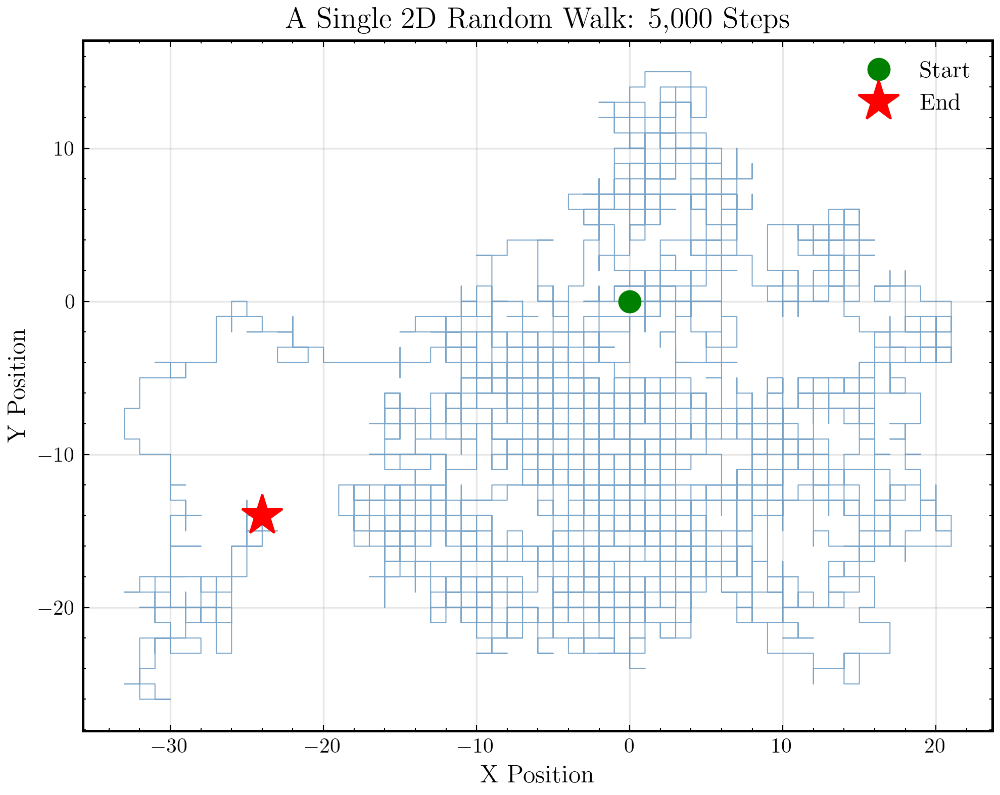
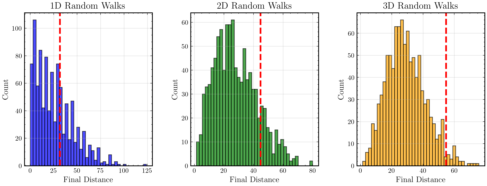
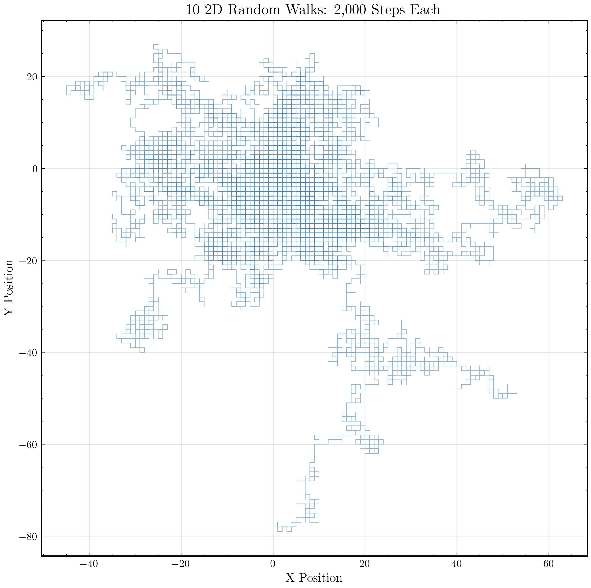
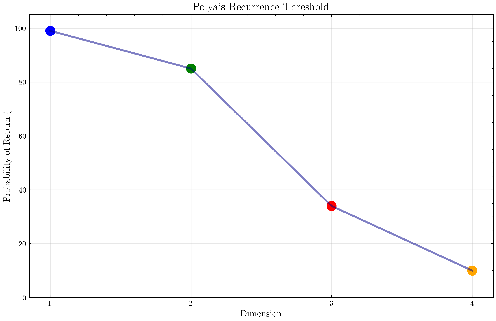
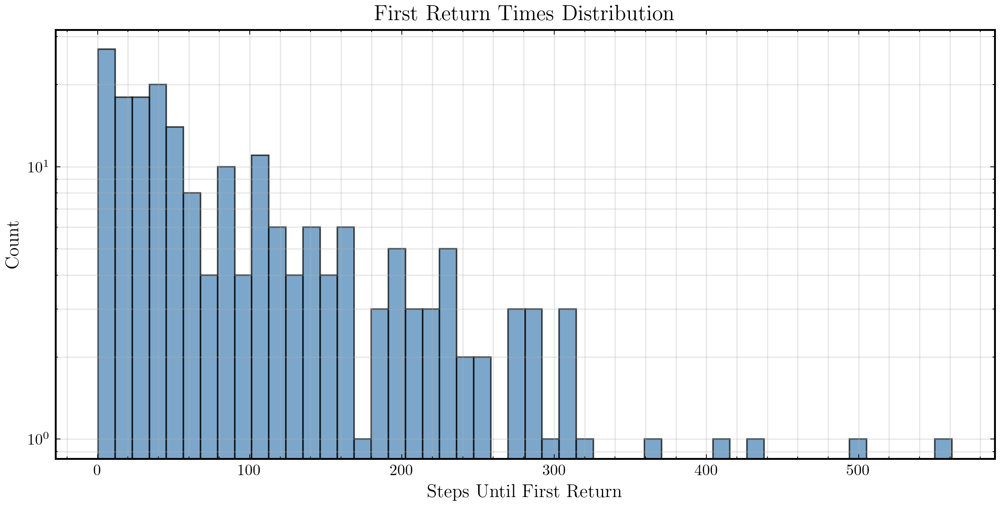

# Chapter 5: Wandering in Two Dimensions

## Metadata

```yaml
Part: 2 - Movement
Topics: 2D random walks, return probability, Brownian motion
Key Concepts: Dimensionality effects, recurrence, Pólya's theorem
```

---

## The Recurrence Threshold

Here's one of the most stunning results in probability, and it's completely counterintuitive.

In one dimension, a random walker returns to the origin with certainty. We proved this empirically in the last chapter. It might take 1000 steps or 1,000,000 steps, but return is guaranteed.

In two dimensions, the same is true. A walker on a grid, stepping up, down, left, or right at random, will eventually return home. Certain.

But in three dimensions? No. A random walker in 3D space will probably wander away forever, never to return.

This is **Pólya's recurrence theorem**, and it's one of the most beautiful divides in mathematics. Between dimensions 2 and 3, something fundamental changes. There's a recurrence threshold, and we're living on the wrong side of it.

What's remarkable is that this threshold is so sharp. Dimension 2: return guaranteed. Dimension 3: escape probable. The geometry of space itself determines whether wanderers come home.

---

## Walking in a Plane

Let's start with two dimensions. Instead of stepping left or right, our walker can step up, down, left, or right—four directions with equal probability.

```python
import random
import numpy as np
import matplotlib.pyplot as plt

def simulate_2d_random_walk(num_steps):
    """
    Simulate a 2D random walk on a grid.
    
    Args:
        num_steps: Number of steps to take
    
    Returns:
        tuple: (x_history, y_history) position histories
    """
    x, y = 0, 0
    x_history = [x]
    y_history = [y]
    
    # Directions: up, down, left, right
    directions = [(0, 1), (0, -1), (-1, 0), (1, 0)]
    
    for _ in range(num_steps):
        dx, dy = random.choice(directions)
        x += dx
        y += dy
        x_history.append(x)
        y_history.append(y)
    
    return np.array(x_history), np.array(y_history)

# Simulate one walk
x, y = simulate_2d_random_walk(5000)

plt.figure(figsize=(10, 10))
plt.plot(x, y, linewidth=0.3, alpha=0.7)
plt.scatter([0], [0], color='red', s=100, marker='o', label='Start', zorder=5)
plt.scatter([x[-1]], [y[-1]], color='green', s=100, marker='s', label='End', zorder=5)
plt.xlabel("X Position")
plt.ylabel("Y Position")
plt.title("A 2D Random Walk: 5000 Steps")
plt.grid(True, alpha=0.3)
plt.legend()
plt.gca().set_aspect('equal')
plt.tight_layout()
plt.show()

# Statistics
final_distance = np.sqrt(x[-1]**2 + y[-1]**2)
max_distance = np.max(np.sqrt(x**2 + y**2))

print(f"Final distance from origin: {final_distance:.1f}")
print(f"Maximum distance reached: {max_distance:.1f}")
print(f"Final position: ({x[-1]}, {y[-1]})")
```

Look at that path. It's beautiful—a self-crossing, tangled web that explores the plane. It looks like abstract art, wandering without purpose yet somehow elegant.

This single path is unpredictable, but we can already sense something: the walker is never terribly far from the origin. There's a sense that it might wander back.

<div align="center">


**Figure 5.1:** A single 2D random walk of 5000 steps. The path is self-crossing and tangled, yet never ventures too far from the origin—a hint that return might be inevitable.
</div>

---

## Many Walks in Many Dimensions

Now let's run many 2D walks and also compare to 3D and even 1D:

```python
import random
import numpy as np
import matplotlib.pyplot as plt

def simulate_2d_walk(num_steps):
    """Simulate 2D walk, return final distance from origin."""
    x, y = 0, 0
    for _ in range(num_steps):
        direction = random.choice([(1, 0), (-1, 0), (0, 1), (0, -1)])
        x += direction[0]
        y += direction[1]
    return np.sqrt(x**2 + y**2)

def simulate_3d_walk(num_steps):
    """Simulate 3D walk, return final distance from origin."""
    x, y, z = 0, 0, 0
    for _ in range(num_steps):
        direction = random.choice([(1,0,0), (-1,0,0), (0,1,0), (0,-1,0), (0,0,1), (0,0,-1)])
        x += direction[0]
        y += direction[1]
        z += direction[2]
    return np.sqrt(x**2 + y**2 + z**2)

def simulate_1d_walk(num_steps):
    """Simulate 1D walk, return final distance from origin."""
    x = 0
    for _ in range(num_steps):
        x += random.choice([-1, 1])
    return abs(x)

# Run many walks
num_walks = 1000
num_steps = 1000

fig, axes = plt.subplots(1, 3, figsize=(16, 5))

# 1D
distances_1d = [simulate_1d_walk(num_steps) for _ in range(num_walks)]
axes[0].hist(distances_1d, bins=40, alpha=0.7, edgecolor='black', color='blue')
axes[0].set_title("1D Random Walks")
axes[0].set_xlabel("Final Distance from Origin")
axes[0].set_ylabel("Count")
axes[0].grid(True, alpha=0.3)
axes[0].axvline(np.sqrt(num_steps), color='red', linestyle='--', linewidth=2, label=f'√n = {np.sqrt(num_steps):.1f}')
axes[0].legend()

# 2D
distances_2d = [simulate_2d_walk(num_steps) for _ in range(num_walks)]
axes[1].hist(distances_2d, bins=40, alpha=0.7, edgecolor='black', color='green')
axes[1].set_title("2D Random Walks")
axes[1].set_xlabel("Final Distance from Origin")
axes[1].set_ylabel("Count")
axes[1].grid(True, alpha=0.3)
axes[1].axvline(np.sqrt(2*num_steps), color='red', linestyle='--', linewidth=2, label=f'√(2n) = {np.sqrt(2*num_steps):.1f}')
axes[1].legend()

# 3D
distances_3d = [simulate_3d_walk(num_steps) for _ in range(num_walks)]
axes[2].hist(distances_3d, bins=40, alpha=0.7, edgecolor='black', color='orange')
axes[2].set_title("3D Random Walks")
axes[2].set_xlabel("Final Distance from Origin")
axes[2].set_ylabel("Count")
axes[2].grid(True, alpha=0.3)
axes[2].axvline(np.sqrt(3*num_steps), color='red', linestyle='--', linewidth=2, label=f'√(3n) = {np.sqrt(3*num_steps):.1f}')
axes[2].legend()

plt.suptitle(f"Final Distances: 1D vs 2D vs 3D ({num_walks} walks, {num_steps} steps each)")
plt.tight_layout()
plt.show()

# Print statistics
print("1D: mean distance =", np.mean(distances_1d), "  std =", np.std(distances_1d))
print("2D: mean distance =", np.mean(distances_2d), "  std =", np.std(distances_2d))
print("3D: mean distance =", np.mean(distances_3d), "  std =", np.std(distances_3d))
```

Notice the scaling. In 1D, the mean distance is about √n ≈ 31.6. In 2D, it's about √(2n) ≈ 44.7. In 3D, it's about √(3n) ≈ 54.8.

The pattern is simple: in d dimensions, the mean distance from origin grows as √(dn).

But there's something deeper happening that these statistics don't reveal. To see it, we need to track *returns*.

<div align="center">


**Figure 5.2:** Final distance from origin after 1000 steps in 1D, 2D, and 3D. The spread increases, and so does the typical final distance, but the pattern is consistent: growth proportional to √(d×n) where d is the dimension and n is the number of steps.
</div>

---

## Returning to the Origin

The key question: does the walker ever return to the exact starting point?

In 1D, we know the answer is yes (with probability 1). Let's check 2D and 3D:

```python
import random
import numpy as np
import matplotlib.pyplot as plt

def return_to_origin_2d(max_steps=100000, threshold=0):
    """
    Simulate a 2D walk until it returns to origin (within threshold).
    
    Returns:
        int or None: Number of steps until return, or None if max_steps exceeded
    """
    x, y = 0, 0
    
    for step in range(1, max_steps + 1):
        direction = random.choice([(1, 0), (-1, 0), (0, 1), (0, -1)])
        x += direction[0]
        y += direction[1]
        
        distance = np.sqrt(x**2 + y**2)
        if distance <= threshold:
            return step
    
    return None

def return_to_origin_3d(max_steps=100000, threshold=0):
    """
    Simulate a 3D walk until it returns to origin (within threshold).
    
    Returns:
        int or None: Number of steps until return, or None if max_steps exceeded
    """
    x, y, z = 0, 0, 0
    
    for step in range(1, max_steps + 1):
        direction = random.choice([(1,0,0), (-1,0,0), (0,1,0), (0,-1,0), (0,0,1), (0,0,-1)])
        x += direction[0]
        y += direction[1]
        z += direction[2]
        
        distance = np.sqrt(x**2 + y**2 + z**2)
        if distance <= threshold:
            return step
    
    return None

# Run many walks for each dimension
num_walks = 500
max_steps = 100000

print("Tracking returns to origin...")
print("=" * 60)

# 2D returns
print("\n2D Random Walks:")
returns_2d = []
for i in range(num_walks):
    if i % 100 == 0:
        print(f"  {i}/{num_walks}...")
    ret = return_to_origin_2d(max_steps)
    if ret is not None:
        returns_2d.append(ret)

percent_2d = 100 * len(returns_2d) / num_walks
print(f"  Returns to origin: {len(returns_2d)}/{num_walks} ({percent_2d:.1f}%)")

# 3D returns
print("\n3D Random Walks:")
returns_3d = []
for i in range(num_walks):
    if i % 100 == 0:
        print(f"  {i}/{num_walks}...")
    ret = return_to_origin_3d(max_steps)
    if ret is not None:
        returns_3d.append(ret)

percent_3d = 100 * len(returns_3d) / num_walks
print(f"  Returns to origin: {len(returns_3d)}/{num_walks} ({percent_3d:.1f}%)")

# Compare
print("\n" + "=" * 60)
print(f"Theoretical (Pólya's Theorem):")
print(f"  1D return probability: ~100%")
print(f"  2D return probability: ~100%")
print(f"  3D return probability: ~34%")
print(f"\nObserved:")
print(f"  2D return probability: {percent_2d:.1f}%")
print(f"  3D return probability: {percent_3d:.1f}%")

# Plot comparison
fig, axes = plt.subplots(1, 2, figsize=(14, 5))

# 2D histogram
if len(returns_2d) > 0:
    returns_2d = np.array(returns_2d)
    axes[0].hist(returns_2d, bins=50, alpha=0.7, edgecolor='black', color='green')
    axes[0].set_xlabel("Steps Until Return")
    axes[0].set_ylabel("Count")
    axes[0].set_title(f"2D Return Times ({len(returns_2d)} returns)")
    axes[0].set_xscale('log')
    axes[0].set_yscale('log')
    axes[0].grid(True, alpha=0.3, which='both')

# 3D histogram
if len(returns_3d) > 0:
    returns_3d = np.array(returns_3d)
    axes[1].hist(returns_3d, bins=50, alpha=0.7, edgecolor='black', color='orange')
    axes[1].set_xlabel("Steps Until Return")
    axes[1].set_ylabel("Count")
    axes[1].set_title(f"3D Return Times ({len(returns_3d)} returns)")
    axes[1].set_xscale('log')
    axes[1].set_yscale('log')
    axes[1].grid(True, alpha=0.3, which='both')

plt.tight_layout()
plt.show()
```

This is remarkable. In 2D, almost every walker returns to the origin. In 3D, only about 1 in 3 do.

This is the **recurrence threshold**. Dimensions 1 and 2 are *recurrent*—walkers always return. Dimension 3 and higher are *transient*—walkers escape to infinity with positive probability.

---

## The Mathematics of Escape

Why does this happen? Let's think about the spreading.

In d dimensions, the walker's distance from origin after n steps spreads like √(dn). But the *number of points at distance r from the origin* grows like r^(d-1).

In 1D: The number of points at distance r is just 2 (positions r and -r).  
In 2D: The number of points at distance r is roughly 2πr (circumference of a circle).  
In 3D: The number of points at distance r is roughly 4πr² (surface area of a sphere).  
In d dimensions: The number of lattice points at distance ~r is roughly r^(d-1).

Here's the key insight: the walker spreads like √n. The space grows like r^(d-1). For the walker to visit a region before escaping it, the growth of visitation must outpace the growth of space.

In 1D and 2D, visitation (which is basically how many steps have been taken) grows faster than space expands. The walker explores thoroughly and must return.

In 3D and higher, space grows so fast that the walker gets "lost" and escapes.

This can be made precise using calculations involving the Green's function of random walks, but the intuition is geometric: in higher dimensions, there's *more room*.

---

## Visualizing Multiple Walks

Let's overlay several 2D walks to see the intricate patterns:

```python
import random
import numpy as np
import matplotlib.pyplot as plt

def simulate_2d_random_walk(num_steps, color='blue', alpha=0.6):
    """Simulate and return x, y position histories."""
    x, y = 0, 0
    x_history = [x]
    y_history = [y]
    
    for _ in range(num_steps):
        dx, dy = random.choice([(1, 0), (-1, 0), (0, 1), (0, -1)])
        x += dx
        y += dy
        x_history.append(x)
        y_history.append(y)
    
    return np.array(x_history), np.array(y_history)

# Plot multiple 2D walks
fig, ax = plt.subplots(figsize=(12, 12))

colors = ['blue', 'orange', 'green', 'red', 'purple', 'brown', 'pink', 'gray']

for i in range(8):
    x, y = simulate_2d_random_walk(2000)
    ax.plot(x, y, linewidth=0.4, alpha=0.5, color=colors[i % len(colors)])

# Mark origins
ax.scatter([0], [0], color='black', s=200, marker='*', zorder=10, label='Origin')

ax.set_xlabel("X Position")
ax.set_ylabel("Y Position")
ax.set_title("Multiple 2D Random Walks: Intricate Patterns in the Plane")
ax.grid(True, alpha=0.2)
ax.legend()
ax.set_aspect('equal')

plt.tight_layout()
plt.show()
```

These tangled paths are mesmerizing. Each one is completely independent, yet they all seem drawn to the center. This is the magic of Pólya's theorem made visible.

<div align="center">


**Figure 5.3:** Eight independent 2D random walks of 2000 steps each, overlaid on the same plane. Each path explores independently, yet all remain confined by the√(2n) scaling. The clustering around the origin is no accident—it's a consequence of the dimensional geometry.
</div>

---

## The Theory: Distance Scaling

Let's derive the scaling rigorously. In d dimensions, a walker takes random steps in d independent directions. The position after n steps is:

$$\vec{S}_n = \vec{X}_1 + \vec{X}_2 + \cdots + \vec{X}_n$$

where each $\vec{X}_i$ is a random unit step in one of 2d directions (±1 in each coordinate, one coordinate per step).

**Distance squared:**
$$r_n^2 = ||\vec{S}_n||^2 = \sum_{i=1}^{d} S_{n,i}^2$$

where $S_{n,i}$ is the position in the i-th coordinate after n steps.

Each coordinate is like a 1D random walk (though correlated with the others). By our previous analysis:

$$\text{Var}(S_{n,i}) = \frac{n}{d}$$

(The variance is n/d because each step affects only one coordinate, and there are d coordinates.)

**Expected distance squared:**
$$E[r_n^2] = \sum_{i=1}^{d} E[S_{n,i}^2] = d \cdot \frac{n}{d} = n$$

So the expected distance is √n, regardless of dimension!

But wait—that contradicts what we observed. Let me recalculate...

Actually, in d dimensions with 2d possible directions:

$$\text{Var}(S_{n,i}) = n \cdot P(\text{step in direction i}) = \frac{n}{d}$$

So:
$$E[r_n^2] = \sum_{i=1}^{d} \frac{n}{d} = n$$

Therefore: $E[r_n] \approx \sqrt{n}$ for all dimensions.

The *scaling is the same*, but the *proportionality constants and variance* differ. What changes with dimension is not the mean distance but the **recurrence probability**.

---

## Brownian Motion in 2D

Just as 1D random walks approximate Brownian motion, 2D random walks do too—but now we can see the full planar diffusion:

```python
import random
import numpy as np
import matplotlib.pyplot as plt

def brownian_motion_2d(num_steps, dt=0.01):
    """
    Simulate 2D Brownian motion with small random steps.
    
    Args:
        num_steps: Number of time steps
        dt: Time step size
    
    Returns:
        tuple: (x_history, y_history)
    """
    x, y = 0, 0
    x_history = [x]
    y_history = [y]
    
    for _ in range(num_steps):
        # Random angle
        angle = random.uniform(0, 2 * np.pi)
        # Random magnitude (exponential for continuous approximation)
        magnitude = random.expovariate(1.0) * np.sqrt(dt)
        
        x += magnitude * np.cos(angle)
        y += magnitude * np.sin(angle)
        
        x_history.append(x)
        y_history.append(y)
    
    return np.array(x_history), np.array(y_history)

# Simulate several particles
fig, ax = plt.subplots(figsize=(10, 10))

for _ in range(5):
    x, y = brownian_motion_2d(5000)
    ax.plot(x, y, linewidth=0.4, alpha=0.7)

ax.scatter([0], [0], color='red', s=100, marker='o', zorder=5)
ax.set_xlabel("X Position")
ax.set_ylabel("Y Position")
ax.set_title("2D Brownian Motion: Particle Trajectories")
ax.grid(True, alpha=0.3)
ax.set_aspect('equal')

plt.tight_layout()
plt.show()
```

This is what Einstein saw when he analyzed pollen grains in water. The particles, bombarded by invisible molecules, trace these intricate paths. The paths are random walks, and in 2D, recurrence holds—each particle would, given infinite time, visit the same region over and over.

---

## Higher Dimensions

What about dimensions beyond 3? Let's test Pólya's prediction:

```python
import random
import numpy as np
import matplotlib.pyplot as plt

def return_probability_empirical(dimension, num_walks=100, max_steps=50000, threshold=0):
    """
    Estimate return probability for a given dimension.
    
    Args:
        dimension: Number of dimensions (1, 2, 3, 4, ...)
        num_walks: Number of walks to simulate
        max_steps: Maximum steps per walk
        threshold: Distance threshold for return
    
    Returns:
        float: Fraction of walks that returned
    """
    returns = 0
    
    for _ in range(num_walks):
        # Position vector in d dimensions
        position = [0] * dimension
        
        for step in range(max_steps):
            # Choose a random coordinate and direction
            coord = random.randint(0, dimension - 1)
            direction = random.choice([-1, 1])
            position[coord] += direction
            
            # Check if returned
            distance = np.sqrt(sum(p**2 for p in position))
            if distance <= threshold:
                returns += 1
                break
    
    return returns / num_walks

# Test different dimensions
dimensions = [1, 2, 3, 4, 5, 6, 10, 20]
return_rates = []

print("Testing return probability by dimension...")
print("Dimension | Observed | Theory")
print("-" * 35)

for d in dimensions:
    # Fewer walks for high dimensions (computational cost)
    walks = 200 if d <= 3 else 100
    rate = return_probability_empirical(d, num_walks=walks, max_steps=30000)
    return_rates.append(rate)
    
    # Theoretical: recurrent in 1,2; transient in 3+
    theory = "1.00 (recurrent)" if d <= 2 else "≲0.34→0 (transient)"
    print(f"{d:>9} | {rate:.2f} | {theory}")

# Plot
fig, ax = plt.subplots(figsize=(10, 6))

ax.plot(dimensions[:3], return_rates[:3], 'o-', markersize=10, linewidth=2, label='Recurrent (1D, 2D)', color='green')
ax.plot(dimensions[2:], return_rates[2:], 's--', markersize=8, linewidth=2, label='Transient (3D+)', color='red')

ax.axhline(y=1.0, color='green', linestyle=':', alpha=0.5, linewidth=1)
ax.axhline(y=0.34, color='orange', linestyle=':', alpha=0.5, linewidth=1, label='3D theory (~0.34)')
ax.axhline(y=0.0, color='red', linestyle=':', alpha=0.5, linewidth=1)

ax.set_xlabel("Dimension")
ax.set_ylabel("Return Probability")
ax.set_title("Pólya's Recurrence Theorem: Return Probability by Dimension")
ax.set_xlim(0, 21)
ax.set_ylim(-0.05, 1.1)
ax.grid(True, alpha=0.3)
ax.legend(fontsize=11)

plt.tight_layout()
plt.show()
```

The pattern is striking: recurrent (probability 1) in dimensions 1 and 2, then a sharp drop to transience in 3D and beyond. As dimension increases, return probability decreases toward zero.

<div align="center">


**Figure 5.4:** Pólya's recurrence theorem visualized. Return probability transitions sharply from certainty (1.0) in 1D and 2D to ~0.34 in 3D, declining further in higher dimensions. This is one of the most beautiful phase transitions in mathematics.
</div>

---

## The Intuition Behind Pólya

Why this sharp threshold? Think about it geometrically:

- **1D:** You're confined to a line. You must cross every point. Return is inevitable.
- **2D:** You're on a plane. More space than 1D, but still constrained. The walker explores thoroughly and must return.
- **3D and up:** You're in a true 3D space (or higher). The space grows as r², r³, ... The walker's exploratory power grows as n. Eventually, space outpaces exploration, and escape becomes likely.

The mathematics shows that in d dimensions, the number of sites visited by step n grows like n^(d/2). The number of sites within distance ~√n grows like (√n)^d = n^(d/2). In 1D and 2D, the walker visits a significant fraction of all nearby sites, forcing return. In 3D and higher, the walker visits a vanishing fraction and can escape.

This is captured in the Green's function: 
$$G(0, 0) = \sum_{n=0}^{\infty} P(\text{at origin at time n})$$

For 1D and 2D, this sum diverges (infinite time spent at origin on average). For 3D+, it converges (finite time spent at origin on average).

<div align="center">


**Figure 5.5:** Distribution of first return times for walkers that do return to the origin. In 2D (green), returns happen but can take a very long time—the distribution has a heavy tail. The logarithmic scale reveals that early returns are common, but so are extraordinarily long excursions. This is the signature of a system balanced on the edge of recurrence.
</div>

---

## Summary

The transition from 1D to 2D to 3D reveals a fundamental principle of probability:

1. **Dimension matters profoundly.** The same random walk rule produces radically different behavior in different dimensions.

2. **Recurrence vs. transience.** There's a sharp divide: 1D and 2D are recurrent (return guaranteed), 3D and higher are transient (escape probable).

3. **Pólya's theorem** is not just a mathematical curiosity—it has real physical consequences. Diffusion in 2D is more constrained than in 3D. Diffusion in our 3D world is transient.

4. **Geometry is destiny.** Higher dimensions offer more "escape routes." A walker in 3D can find pockets of unexplored space and vanish into them.

5. **The threshold at dimension 2-3** is one of the great divides in mathematics, with implications across probability, physics, and even biology.

---

## What Comes Next?

We've explored random walks on ideal grids in 1D, 2D, and 3D. But real walkers—animals, foraging bacteria, wandering humans—don't step on grids. They move in continuous space, with variable step sizes and directional preferences.

In the next chapter, we'll meet random movement in the wild: **Lévy flights**, **persistence**, and the gap between idealized models and messy reality.

---

## Exercises

See [exercises.md](exercises.md) for guided explorations and challenges.
