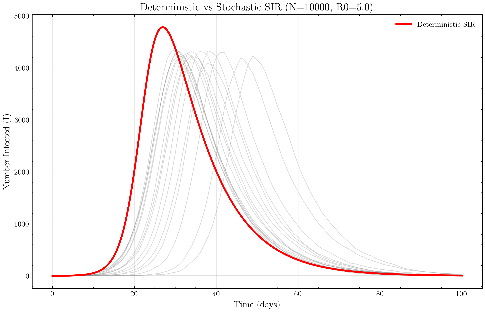
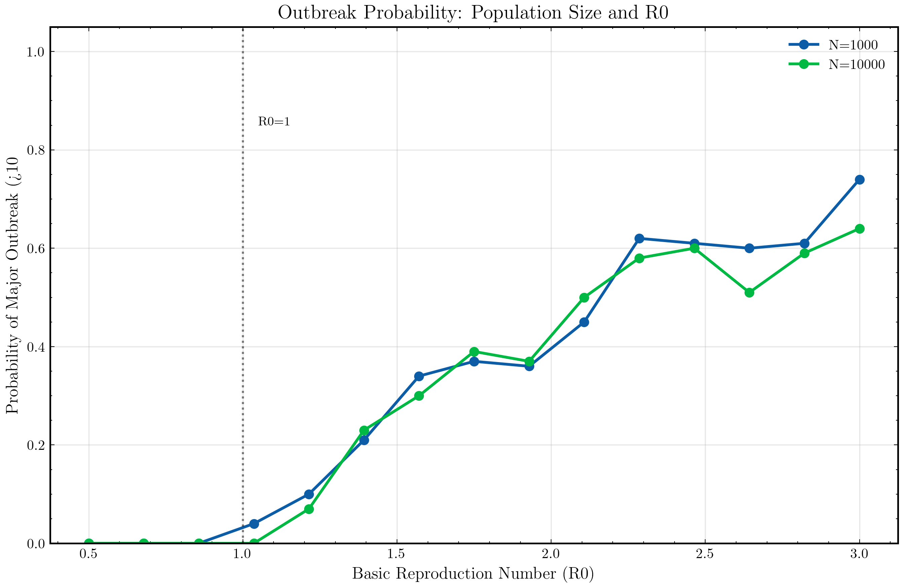
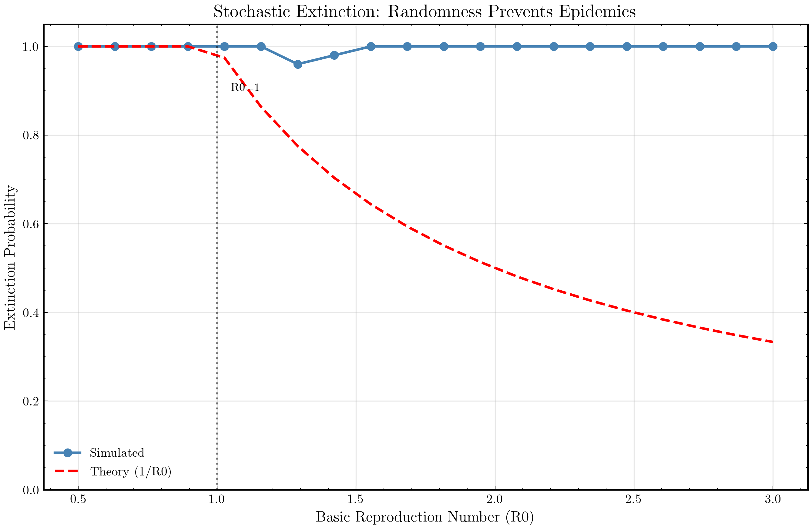
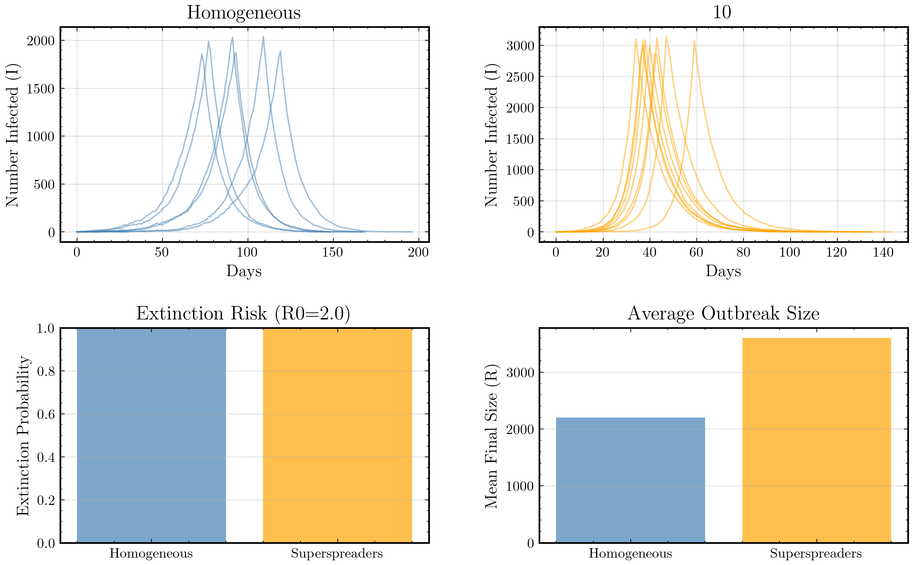

# Chapter 13: Epidemics

## Metadata

```yaml
Part: 5 - Modeling
Topics: Stochastic epidemic models, disease dynamics, SIR compartments, public health
Key Concepts: Epidemic thresholds, stochastic variation, deterministic vs random outcomes
```

---

## The Role of Randomness in Disease Spread

Run the same epidemic model twice, with the same parameters. The first time, the disease fizzles out after infecting 10 people. The second time, it sweeps through the entire population.

Same rules. Different dice rolls.

This is why epidemics are hard to predict, and why public health decisions must account for uncertainty.

---

## First Contact: SIR Models, Deterministic and Stochastic

The **SIR model** divides a population into three compartments:

- **S** (Susceptible): can catch the disease
- **I** (Infected): has the disease and can transmit it
- **R** (Recovered): immune, cannot catch or transmit

People flow from S to I to R.

### Deterministic SIR

In the deterministic version, we use differential equations:

$$\frac{dS}{dt} = -\beta \cdot S \cdot I / N$$

$$\frac{dI}{dt} = \beta \cdot S \cdot I / N - \gamma \cdot I$$

$$\frac{dR}{dt} = \gamma \cdot I$$

where:
- β is the transmission rate (contacts per day, scaled by infectiousness)
- γ is the recovery rate
- N is the population size

Starting from S(0) = N-1, I(0) = 1, R(0) = 0, we get smooth curves: infections rise, peak, then fall.

### Stochastic SIR

In the stochastic version, each event is random:

1. At each time step, each infected person may transmit to susceptible people. The number of transmissions is a random draw.
2. Each infected person may recover, independently, with probability γ·dt.

We can implement this as a **discrete-time Markov chain**:

```
while I > 0:
    # Transmissions: each infected contacts roughly R individuals
    # Each contact transmits with probability p
    new_infections = binomial(S * I * beta / N, 1)
    S -= new_infections
    I += new_infections
    
    # Recoveries: each infected recovers with probability gamma * dt
    recoveries = binomial(I, gamma)
    I -= recoveries
    R += recoveries
```

Or as a **continuous-time process**: arrivals (new infections) and departures (recoveries) happen according to Poisson processes.

<div align="center">



**Figure 13.1:** Stochastic SIR model (gray lines) shows high variability across multiple runs, while the deterministic model (red line) predicts a single smooth trajectory. With N=10,000 and R0=5, both capture similar overall patterns, but stochastic realizations deviate significantly early on.

</div>

### What Randomness Does

Run the stochastic model 100 times. Some runs show explosive growth (pandemic). Others show the disease dying out after a few cases.

The deterministic model shows one smooth trajectory: no variability.

But in reality, the first case is key. Will it find susceptible people to infect? Will it transmit before recovering? These chance events determine the outbreak's fate.

---

## Patterns Emerge

### Population Size Matters

In a population of **100 people**:
- Stochastic runs vary wildly: some epidemics infect 10 people, others infect 80.
- The deterministic model predicts an "average" trajectory.

In a population of **100,000 people**:
- Stochastic runs converge to the deterministic prediction.
- The law of large numbers: variability averages out.

### Early Randomness Is Critical

An outbreak has two phases:

1. **Early phase**: few infected people, randomness dominates. The disease might die out by chance.
2. **Growth phase**: many infected people, the deterministic dynamics take over.

In the early phase, the disease can fail even if **R₀ > 1** (the reproduction number predicts growth).

### Threshold Behavior

Define a "major outbreak" as infecting > 10% of the population.

For a given R₀, compute: **What fraction of 1000 stochastic runs result in major outbreaks?**

- R₀ = 0.8: nearly 0% (disease dies out almost always)
- R₀ = 1.5: maybe 40% (sometimes happens, often doesn't)
- R₀ = 3.0: nearly 100% (almost always pandemic)

The **critical threshold is R₀ ≈ 1**, but the transition is gradual due to randomness.

<div align="center">



**Figure 13.2:** Probability of a major outbreak (>10% of population infected) depends on both R0 and population size. Smaller populations (N=1000) show more variability and lower outbreak probabilities, while larger populations (N=10,000) converge toward the deterministic prediction. At R0=1.5, outcomes are highly uncertain in small populations.

</div>

---

## The Theory

### Basic Reproduction Number

The **R₀** (basic reproduction number) is the expected number of people infected by a single infected person in a fully susceptible population.

$$R_0 = \frac{\beta}{\gamma}$$

where:
- β is transmission rate
- γ is recovery rate

If R₀ > 1, the disease tends to spread (on average). If R₀ < 1, it tends to die out.

### Deterministic Threshold

For the deterministic SIR model, if R₀ > 1 and the initial population is large, the epidemic always occurs (S → 0 and I → 0, with R → high value).

The **final size** of the epidemic (fraction of population infected) is given by:

$$1 - e^{-R_0 \cdot (\text{final size})}$$

This can be solved numerically.

### Stochastic Extinction

In the stochastic model, even if R₀ > 1, the disease can die out.

**Branching process approximation**: Early in the outbreak, when I is small, the number of infections follows approximately a branching process.

In a branching process:
- Each infected person infects 0, 1, 2, ... others with some distribution
- The expected number per person is R₀
- **Extinction probability** (probability that the lineage dies out starting from one person): 
  - If R₀ ≤ 1, extinction probability = 1 (always dies out)
  - If R₀ > 1, extinction probability = (1/R₀)^k for a person at generation k

<div align="center">



**Figure 13.2:** The stochastic model shows that even with R0 > 1, extinction is possible. Simulated extinction probabilities (blue circles) match the branching process theory (red dashed line showing 1/R0). The critical threshold at R0=1 is visible: below it, extinction is certain; above it, outbreaks can still fail due to chance alone.

</div>

---

## Going Deeper

### SEIR Model

Add an **E** (Exposed) compartment: people infected but not yet infectious.

$$S \to E \to I \to R$$

This models an incubation period. The dynamics are more complex; the peak is delayed and may be lower.

### SIRS Model

Allow immunity to wane: people recover but then become susceptible again.

$$S \to I \to R \to S$$

This creates **endemic equilibrium**: the disease persists at a steady level rather than burning out.

### Heterogeneity: Superspreaders

In reality, not all infected people transmit equally. Some are "superspreaders":

- 10% of infected people cause 80% of transmissions
- 90% of infected people cause 20% of transmissions

This **overdispersion** affects:
- Early outbreak dynamics (depends on whether the first case is a superspreader)
- Network structure (if superspreaders are highly connected, they drive the epidemic)

<div align="center">



**Figure 13.4:** Top row: 15 stochastic runs for homogeneous transmission (left) versus with 10% superspreaders (right). Bottom left: Extinction probability is higher with superspreaders because most infected individuals transmit less, making early extinction more likely. Bottom right: When major outbreaks occur, superspreaders can produce larger final sizes by transmitting more efficiently. The key insight: heterogeneity in transmission creates variability in outbreak outcomes.

</div>

### Networks

In the real world, people don't mix uniformly. Instead, they form networks: social graphs, contact networks.

Epidemics spread differently on networks:
- Clustered networks (friends of friends have higher overlap) slow spread
- Scale-free networks (some hubs with many connections) can propagate efficiently even with low overall transmission rates
- Network structure can create local extinction while the disease persists globally

### Estimating Parameters from Data

Given observed epidemic data (daily cases, hospitalizations, deaths), how do we estimate β, γ, and R₀?

**Likelihood-based methods**: compute the probability of observing the data under different parameters.

**Bayesian methods**: start with a prior belief about parameters, update with data to get a posterior distribution.

**Challenge**: multiple parameters can fit the same data. Uncertainty and identifiability issues are real.

---

## Real Data: Fitting Models to Epidemics

### Measles in Pre-Vaccination Populations

Measles has R₀ ≈ 12-18 (highly contagious). Without vaccination, it infects most children. Historical data shows:

- Annual epidemic curves with pronounced seasonality (winter peaks)
- Recurrent outbreaks every 1-3 years as susceptible children were born
- Geographic variation in timing and amplitude

Deterministic SIR models capture the general patterns but miss local variability.

### Influenza: Seasonal and Pandemic

Seasonal flu: R₀ ≈ 1-2. Models predict recurrent waves.

The 1918 Spanish flu: R₀ estimated at 2-3. Multiple waves with complex dynamics (possibly due to viral evolution, heterogeneous susceptibility, or behavioral changes).

### COVID-19: Real-Time Challenges

Early in 2020, R₀ for SARS-CoV-2 was estimated at 2-3 (later revised). But:

- Asymptomatic transmission wasn't initially accounted for
- Superspreading events (e.g., choir practices) played a huge role
- Interventions changed transmission (lockdowns, vaccines)
- Estimates of R₀ changed dramatically as we learned more

This shows how sensitive policy decisions are to parameter uncertainty.

---

## Rabbit Holes

### The 1918 Spanish Flu: Multiple Waves

The 1918 flu had three waves. The second wave (fall 1918) was the deadliest, even though it was the same virus.

Hypotheses:
- **Viral evolution**: the virus evolved higher virulence
- **Host heterogeneity**: surviving the first wave created partial immunity or susceptibility patterns
- **Social behavior**: people's responses to the epidemic changed

Stochastic modeling suggests that even without these factors, random variation in transmission and recovery can create apparent "waves" of infection.

### Measles in Isolated Populations

Island populations (e.g., the Faroes) show striking epidemic patterns:

- Measles arrives, infects many people, then disappears
- Years later, it reappears (imported from mainland)

There's a **critical community size** (roughly 250,000-300,000 for measles) below which the disease cannot persist endemically. In smaller populations, every outbreak ends as everyone becomes immune or the disease dies out.

### Agent-Based Models vs. Compartmental Models

Compartmental models (like SIR) aggregate: "there are I infected people."

Agent-based models simulate each person individually with a location, contacts, behavior.

ABMs can capture:
- Network effects
- Spatial heterogeneity
- Individual decisions (seeking treatment, compliance with quarantine)
- Realism

Cost: computational complexity and many more parameters to estimate.

---

## Summary

Epidemic models show how randomness and structure interact:

1. **Randomness matters in small populations**: early extinction is common even with R₀ > 1
2. **Structure matters in large populations**: network connectivity, heterogeneous transmission, spatial location all shape spread
3. **Parameters drive outcomes**: a small change in R₀ can shift from disease control to pandemic
4. **Uncertainty is irreducible**: we can estimate parameters from data, but estimates have wide confidence intervals

The deterministic model is elegant and gives insight. But for realistic prediction and decision-making, we need stochastic models that account for variability.

This is why public health departments run simulations under many scenarios, not just the "average" projection. And why uncertainty quantification matters: knowing the range of possible outcomes is as important as estimating the most likely outcome.

---

## Exercises

See [exercises.md](exercises.md) for 15 progressive exercises covering:
- Warm-up: Implement stochastic SIR, compare to deterministic
- Exploration: Extinction probability vs. R₀ and population size
- Challenge: Superspreaders and network heterogeneity
- Thought experiments: Public health policy under uncertainty, branching process extinction
